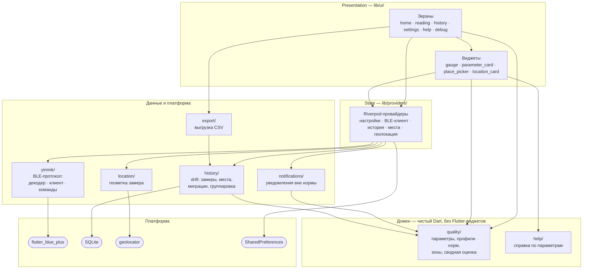
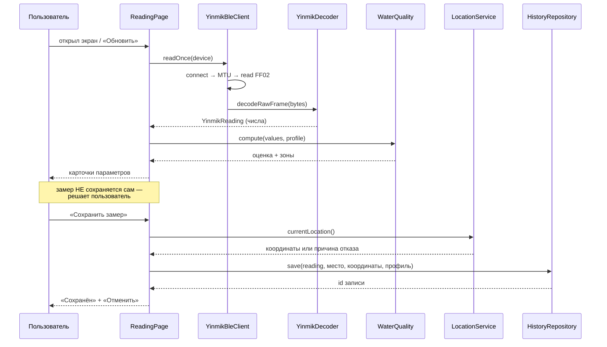

# 01. Архитектура

> **Схема ниже — часть контракта проекта, а не иллюстрация.** Если правка меняет состав слоёв или направление зависимостей между ними, схему нужно обновить тем же коммитом. Схема, разошедшаяся с кодом, хуже отсутствующей: по ней принимают решения.

## Карта модулей



## Правила зависимостей

Их три, и они объясняют, почему модули нарезаны именно так:

1. **`yinmik/` не знает про `quality/`.** Декодер возвращает числа, а не оценки. Поэтому его можно использовать вне приложения — он и портирован 1-в-1 из .NET-сервиса `SmartHomeService`, эталонные кадры в тестах общие.
2. **`quality/` не знает про `yinmik/`.** Оценка качества работает на любом числе подходящей размерности, независимо от того, каким прибором оно получено. Добавить второй прибор — значит добавить декодер, а не переписывать нормы.
3. **Домен не знает про Flutter-виджеты.** Из UI-мира `quality/` использует только `Color` из `dart:ui`. Это граница, за которой начинается тестируемость без `WidgetTester`.

Ещё два правила касаются платформенных модулей:

4. **`location/` не пускает плагин наружу.** `MeasurementLocation` и `LocationFailure` не импортируют `geolocator`; единственное место с этим импортом — `location_service.dart`. Отсюда же вытекает контракт: получение координат **никогда** не роняет и не задерживает сохранение замера.
5. **UI не ходит в БД напрямую.** Между ними `HistoryRepository` / `PlacesRepository`, принимающие доменные типы. Замена drift на что-то другое — это переписывание `repository.dart`, а не экранов.

## Поток данных: от прибора до истории



Два свойства этого потока заданы намеренно и не должны потеряться при доработках:

- **Чтение и сохранение разделены.** Прибор опрашивается сколько угодно раз, в историю попадает только то, что пользователь подтвердил. Иначе калибровочные и тестовые чтения засоряют графики.
- **Геометка и профиль фиксируются в момент сохранения.** Профиль пишется в саму запись, потому что «опасно / норма» — свойство замера, а не текущей настройки приложения.

## Точки расширения

### Новый параметр измерения

Сценарий: добавить, например, «остаточный хлор» (FC), если он появится в кадре или мы его вычислим.

1. **Если параметр приходит в кадре FF02** — добавь поле в `lib/yinmik/reading.dart` и декодинг в `lib/yinmik/decoder.dart`. Тесты в `test/yinmik_decoder_test.dart` обновить с эталонным значением.
2. Добавь константу `WaterParameter` в `lib/quality/catalog.dart`:

   ```dart
   static const WaterParameter freeChlorine = WaterParameter(
     key: 'fc',
     label: 'Хлор',
     unit: 'ppm',
     scaleMin: 0,
     scaleMax: 5,
     fractionDigits: 1,
     description: 'Остаточный хлор. Для питьевой воды до 0.5 ppm.',
     zones: [
       QualityZone(min: 0,   max: 0.3, category: QualityCategory.excellent, label: 'Норма'),
       QualityZone(min: 0.3, max: 1.0, category: QualityCategory.acceptable, label: 'Приемлемо'),
       QualityZone(min: 1.0, max: 5.0, category: QualityCategory.caution,   label: 'Высоко'),
     ],
   );
   ```

3. Добавь параметр во все профили в `WaterParameterCatalog.forProfile(...)` (внутри `lib/quality/catalog.dart`) — у каждого профиля свой набор зон.
4. В `lib/yinmik/reading_values.dart` дополни `readingValues` и `measurementValues` — это **single source of truth** маппинга «домен/БД-запись → `Map<key, value>`»:

   ```dart
   'fc': reading.freeChlorinePpm,
   ```

5. В `lib/help/parameter_help.dart` добавь подробную справку с тонкой градацией зон для нового параметра.
6. Если параметр должен сохраняться в БД — поднять `schemaVersion` в `AppDatabase`, добавить колонку + ветку миграции, перегенерить drift.

Карточка появится автоматически на ReadingPage, HistoryDetailPage, а график получит новую опцию в `DropdownButton` (берётся из `WaterParameterCatalog.forProfile`).

### Слой геометки (`lib/location/`)

Отдельный слой между плагином и UI, устроенный по тому же принципу, что и `yinmik/`: доменные типы не знают про плагин.

- `measurement_location.dart` — `MeasurementLocation` (координаты + точность), `LocationFailure` (причина отказа с человеческим сообщением), `LocationResult`. Зависимостей от `geolocator` нет вообще, поэтому всё это тестируется без моков платформы.
- `location_service.dart` — единственное место, где импортируется `geolocator`.

Ключевое свойство, которое нужно сохранять при доработках: **получение координат никогда не роняет и не задерживает сохранение замера**. Любая проблема (нет разрешения, выключен GPS, не пришёл фикс за 5 секунд, платформенная ошибка) возвращается как `LocationFailure`, а замер сохраняется без координат. Поэтому `LocationService.currentLocation` не бросает исключений наружу.

### Новая чистая логика (например, новый способ группировки истории)

Если хочется протестировать функцию, не делай её private методом UI-виджета — вынеси top-level в `lib/`. Так уже сделано для:

- `groupMeasurementsByDay` (`lib/history/grouping.dart`) — группировка списка измерений по календарной дате. Принимает опциональный `now` параметр для детерминированности в тестах.
- `niceAxisInterval`, `formatChartAxisLabel` (`lib/ui/widgets/chart_axis.dart`) — подбор шага и формата меток оси y графика.

Тесты на оба — `test/measurement_grouping_test.dart`, `test/chart_axis_test.dart`. Берите эти файлы за шаблон при добавлении новой helper-логики.

### Новая команда управления

См. `docs/03-control-commands.md`.

### Новый BLE-прибор (не YINMIK)

Сейчас `YinmikBleClient` и `YinmikDecoder` жёстко привязаны к BLE-C600. Чтобы поддержать второе семейство:

1. Сделай интерфейс `WaterQualityReader` в `lib/yinmik/`:

   ```dart
   abstract interface class WaterQualityReader {
     Future<YinmikReading> readOnce(BluetoothDevice device);
     // ... scan, sendCommand
   }
   ```

2. Перенеси текущий `YinmikBleClient` в реализацию `BleC600Reader` (`implements WaterQualityReader`).
3. Добавь вторую реализацию `BleYc01Reader` со своими UUID и декодером.
4. Перенеси выбор реализации либо на этап scan (по имени устройства), либо в UI как переключатель.

Для MVP это **не нужно**; флаг архитектурной готовности — что декодер и клиент уже разделены.

## Зависимости

### Production
- `flutter_blue_plus` ^1.32.12 — BLE.
- `permission_handler` ^11.3.1 — рантайм-разрешения.
- `flutter_riverpod` ^2.6.1 — state management + DI.
- `go_router` ^14.6.2 — навигация.
- `drift` ^2.21.0 + `sqlite3_flutter_libs` — локальная БД истории.
- `fl_chart` ^0.69.2 — графики.
- `shared_preferences` ^2.3.3 — настройки.
- `flutter_local_notifications` ^18.0.1 — уведомления при выходе из нормы.
- `geolocator` ^13.0.2 — геометка замера.
- `url_launcher` ^6.3.1 — открыть координаты в картографическом приложении.
- `share_plus` ^10.1.2 — экспорт CSV.
- `intl` ^0.20.2 + `flutter_localizations` — локализация.
- `path_provider` + `path` — пути для drift.

### Dev
- `flutter_lints` + `flutter_test` — стандартный комплект.
- `build_runner` + `drift_dev` — code generation для drift.
- `flutter_launcher_icons` + `flutter_native_splash` — сборка иконок/splash.
- `mocktail` — мок-инфраструктура для тестов.
- `integration_test` — e2e-сценарии.

Минимальный Dart SDK: 3.11.5.

## State management

Используется **`flutter_riverpod` 2.x**. Полный обзор провайдеров — в `docs/05-state-and-storage.md`.

Краткая карта:

| Слой | Что | Где |
|---|---|---|
| Singleton-сервисы | `YinmikBleClient`, `AppDatabase`, `NotificationService` | `lib/providers/` |
| Persisted state | `AppSettings` (тема, профиль, lastDevice, currentLabel) | `app_settings.dart` |
| Стримы платформы | `bluetoothAdapterStateProvider` | `bluetooth_state_provider.dart` |
| Стримы БД | `recentMeasurementsProvider` | `history_provider.dart` |

Локальное эфемерное состояние (loading flag, текущая страница) остаётся в `StatefulWidget` с `setState` — не выносится в провайдеры без необходимости.
